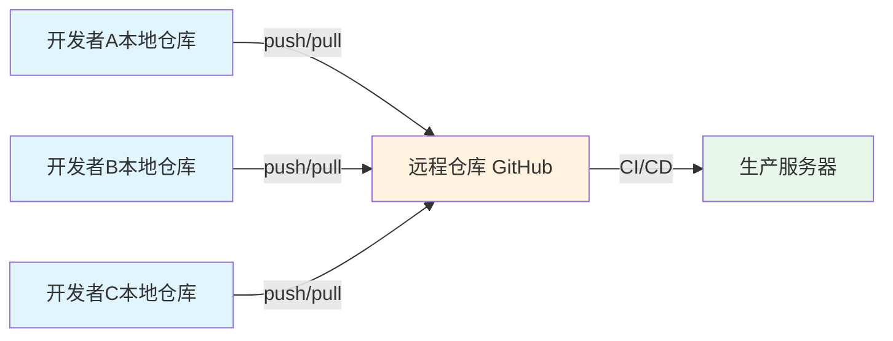
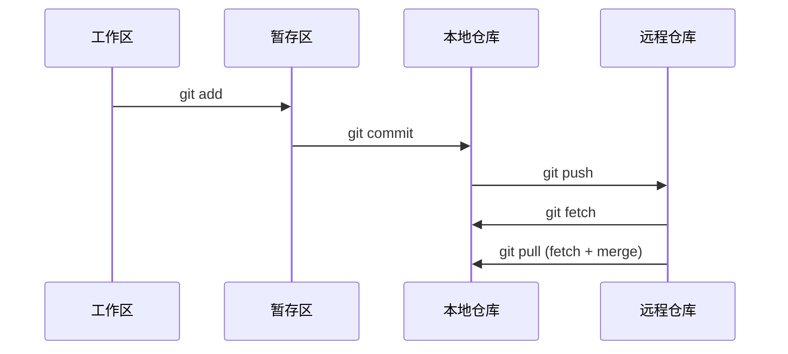
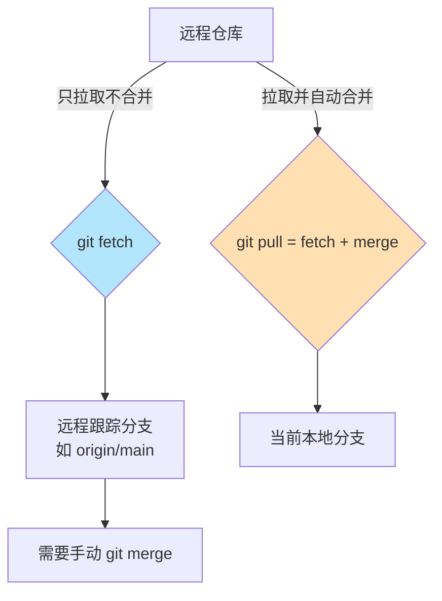
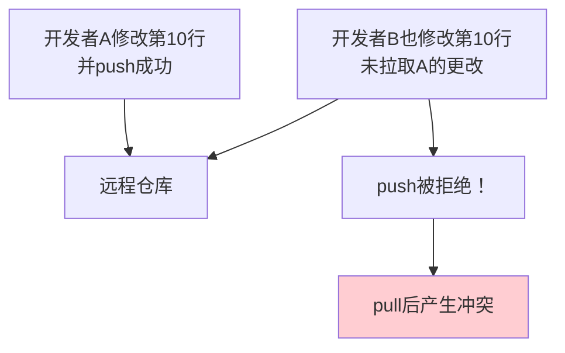
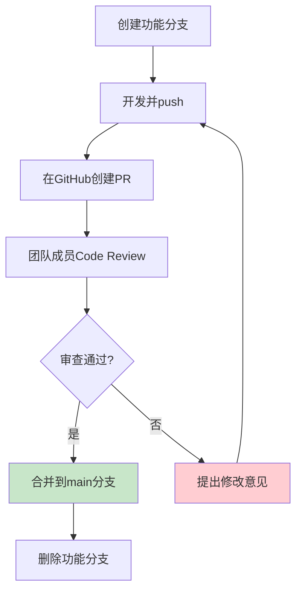

# 第2篇：远程协作与 GitHub 实战

## 学习目标

- 理解远程仓库的概念和作用
- 掌握 `clone` / `push` / `pull` / `fetch` 四大命令
- 能够配置多个远程仓库
- 掌握多人协作的基本工作流
- 理解 HTTPS 与 SSH 两种认证方式的优缺点

---

## 2.1 远程仓库基础

### 什么是远程仓库？

远程仓库是托管在网络上的Git仓库，用于团队协作和代码备份。常见的Git托管平台：

| 平台 | 特点 | 适用场景 |
|------|------|----------|
| **GitHub** | 全球最大的代码托管平台，社区活跃 | 开源项目、个人作品展示 |
| **GitLab** | 支持私有化部署，CI/CD强大 | 企业内部、DevOps |
| **Gitee**（码云） | 国内访问速度快，中文支持好 | 国内项目、企业团队 |
| **Bitbucket** | 与Jira深度集成 | Atlassian生态用户 |

### 远程仓库拓扑图



---

## 2.2 SSH 密钥配置（认证方式对比）

### HTTPS vs SSH

| 对比项 | HTTPS | SSH |
|--------|-------|-----|
| 每次操作需要密码 | ✅ 需要 | ❌ 免密 |
| 配置复杂度 | 简单 | 需要生成密钥 |
| 安全性 | 依赖密码强度 | 加密密钥，更安全 |
| 推荐场景 | 快速测试、公共电脑 | 个人主力开发机器 |

> 📸 **截图点**：GitHub SSH keys 设置页面

---

## 2.3 推拉操作四步曲

### 核心命令关系图



---

## 2.4 场景1：克隆已有仓库

### 2.4.1 典型场景

新加入团队，需要拉取项目代码：

```bash
# 克隆仓库到本地
git clone git@github.com:zhangshuo-byte/git-tutorial-demo.git

# 进入项目目录
cd git-tutorial-demo
```

**输出结果**：

```
Cloning into 'git-tutorial-demo'...
remote: Enumerating objects: 15, done.
remote: Counting objects: 100% (15/15), done.
remote: Compressing objects: 100% (11/11), done.
remote: Total 15 (delta 3), reused 15 (delta 3), pack-reused 0 (from 0)
Receiving objects: 100% (15/15), done.
Resolving deltas: 100% (3/3), done.
```

**查看克隆后的仓库信息**：

```bash
git remote -v
```

**输出结果**：

```
origin  git@github.com:zhangshuo-byte/git-tutorial-demo.git (fetch)
origin  git@github.com:zhangshuo-byte/git-tutorial-demo.git (push)
```

> 💡 **关键点**：clone 操作会自动：
> 1. 下载仓库完整历史
> 2. 自动创建 `origin` 远程跟踪
> 3. 自动检出默认分支（通常是 `main`）

---

### 2.4.2 克隆指定分支

```bash
# 克隆 develop 分支
git clone -b develop git@github.com:zhangshuo-byte/git-tutorial-demo.git

# 浅克隆（只下载最近1次提交历史，节省空间）
git clone --depth 1 git@github.com:zhangshuo-byte/git-tutorial-demo.git
```

---

## 2.5 场景2：推送本地更改

### 2.5.1 典型的每日开发流程

```bash
# 1. 开始工作前，先拉取最新代码
git pull origin main

# 2. 创建并切换到功能分支
git checkout -b feature/login

# 3. 开发...开发...开发...
echo "const login = () => console.log('登录成功');" >> task_manager.py

# 4. 提交更改
git add task_manager.py
git commit -m "添加登录功能接口"

# 5. 推送到远程（第一次推送需要 -u 关联分支）
git push -u origin feature/login
```

**输出结果**：

```
Enumerating objects: 5, done.
Counting objects: 100% (5/5), done.
Delta compression using up to 24 threads
Compressing objects: 100% (3/3), done.
Writing objects: 100% (3/3), 342 bytes | 342.00 KiB/s, done.
Total 3 (delta 1), reused 0 (delta 0), pack-reused 0 (from 0)
remote: 
remote: Create a pull request for 'feature/login' on GitHub by visiting:
remote:   https://github.com/zhangshuo-byte/git-tutorial-demo/pull/new/feature/login
remote: 
To github.com:zhangshuo-byte/git-tutorial-demo.git
 * [new branch]      feature/login -> feature/login
branch 'feature/login' set up to track 'origin/feature/login'.
```

> 💡 **关键点**：GitHub 自动提示创建 Pull Request 的链接！

---

### 2.5.2 后续推送

第一次 `-u` 关联后，后续可以直接：

```bash
git push
```

---

## 2.6 场景3：同步远程更新

### 2.6.1 git fetch 与 git pull 的区别



| 命令 | 作用 |
|------|------|
| `git fetch` | 从远程下载更改，**不合并**到本地分支 |
| `git pull` | 从远程下载更改，**自动合并**到当前分支 |
| `git pull --rebase` | 拉取后用 rebase 代替 merge |

---

### 2.6.2 安全地同步远程更新

**推荐做法**（先 fetch 再决定是否合并）：

```bash
# 1. 获取远程最新状态
git fetch origin

# 2. 查看远程分支有哪些新提交
git log origin/main --oneline

# 3. 确认后再合并
git merge origin/main
```

**快速做法**（信任团队代码，直接用 pull）：

```bash
git pull origin main
```

---

## 2.7 场景4：多人协作冲突解决

### 2.7.1 冲突是如何产生的？



### 2.7.2 实战模拟冲突

**步骤1**：模拟两个开发者同时修改同一文件

```bash
# 开发者A的操作
cd task-manager
echo "// Author: Developer A - 添加任务功能" >> task_manager.py
git add task_manager.py
git commit -m "添加任务功能"
git push origin main
```

**步骤2**：开发者B在另一目录修改

```bash
# 克隆一个新副本，模拟第二台电脑
cd ..
git clone git@github.com:zhangshuo-byte/git-tutorial-demo.git task-manager-b
cd task-manager-b/task-manager

# 开发者B尝试直接推送自己的修改（会冲突）
echo "// Author: Developer B - 修改任务完成逻辑" >> task_manager.py
git add task_manager.py
git commit -b "修改任务完成逻辑"
git push origin main
```

**输出结果**：

```
To github.com:zhangshuo-byte/git-tutorial-demo.git
 ! [rejected]        main -> main (fetch first)
error: failed to push some refs to 'github.com:zhangshuo-byte/git-tutorial-demo.git'
hint: Updates were rejected because the remote contains work that you do not
hint: have locally.
```

> 💡 **关键点**：推送被拒绝！必须先拉取远程最新更改。

---

**步骤3**：解决冲突

```bash
# 拉取并合并
git pull origin main
```

**输出结果**：

```
Auto-merging task_manager.py
CONFLICT (content): Merge conflict in task_manager.py
Automatic merge failed; fix conflicts and then commit the result.
```

**查看冲突文件**：

```bash
git status
```

**输出结果**：

```
On branch main
You have unmerged paths.
  (fix conflicts and run "git commit")
  (use "git merge --abort" to abort the merger)

Unmerged paths:
  (use "git add <file>..." to mark resolution)

        both modified:   task_manager.py
```

---

### 2.7.3 手动解决冲突

打开冲突文件，会看到：

```
#include <iostream>
<<<<<<< HEAD
// Author: Developer B - 修改任务完成逻辑
=======
// Author: Developer A - 添加任务功能
>>>>>>> origin/main
```

**冲突标记说明**：

| 标记 | 含义 |
|------|------|
| `<<<<<<< HEAD` | 当前分支（你的）的代码 |
| `=======` | 分隔线 |
| `>>>>>>> origin/main` | 远程分支（别人的）的代码 |

**解决方案**（保留双方修改）：

```bash
# 编辑文件，删除冲突标记，合并代码
cat > task_manager.py << 'EOF'
# task_manager.py

class TaskManager:
    def __init__(self):
        self.tasks = []

    def add_task(self, name):
        self.tasks.append({'name': name, 'done': False})
        print(f'任务 {name} 已添加')

    def list_tasks(self):
        for i, task in enumerate(self.tasks, 1):
            status = '✓' if task['done'] else '○'
            print(f'{i}. [{status}] {task["name"]}')

    def complete_task(self, index):
        if 1 <= index <= len(self.tasks):
            self.tasks[index-1]['done'] = True
            print(f'任务 {self.tasks[index-1]["name"]} 已完成')
        else:
            print('无效的任务编号')

# 功能修改记录：
# A - 添加任务功能
# B - 修改任务完成逻辑
EOF

# 标记冲突已解决并提交
git add task_manager.py
git commit -m "解决合并冲突：整合开发者A和B的修改"
git push origin main
```

> 📸 **截图点**：编辑冲突文件时的IDE界面，展示冲突标记

---

## 2.8 场景5：Pull Request 工作流

### GitHub 的 Pull Request（PR）

PR 是 GitHub 上提出代码变更、请求审查的流程，是现代团队协作的核心。



### 实际操作流程

```bash
# 1. 从 main 创建功能分支
git checkout main
git pull origin main
git checkout -b feature/user-auth

# 2. 进行开发
echo "def authenticate(username, password): ..." >> auth.py
git add auth.py
git commit -m "实现用户认证函数"

# 3. 推送分支到远程
git push -u origin feature/user-auth

# 4. 在 GitHub 上创建 PR
#   访问：https://github.com/username/repo/pull/new/feature/user-auth
```

> 📸 **截图点**：创建 Pull Request 的 GitHub 页面

---

## 2.9 进阶：管理多个远程仓库

### 2.9.1 添加多个远程

```bash
# 添加 GitHub 远程
git remote add github git@github.com:zhangshuo-byte/git-tutorial-demo.git

# 添加 Gitee 远程
git remote add gitee git@gitee.com:username/git-tutorial-demo.git

# 查看配置
git remote -v
```

**输出结果**：

```
github  git@github.com:zhangshuo-byte/git-tutorial-demo.git (fetch)
github  git@github.com:zhangshuo-byte/git-tutorial-demo.git (push)
gitee   git@gitee.com:username/git-tutorial-demo.git (fetch)
gitee   git@gitee.com:username/git-tutorial-demo.git (push)
```

### 2.9.2 同时推送到多个远程

```bash
# 推送到 GitHub
git push github main

# 推送到 Gitee
git push gitee main

# 同时推送到所有远程（配置 git config）
git config add remote.all.pushurl github
git config add remote.all.pushurl gitee
```

---

## 2.10 本章总结

### 核心命令回顾

| 分类 | 命令 | 作用 |
|------|------|------|
| **克隆** | `git clone <url>` | 将远程仓库克隆到本地 |
| **远程管理** | `git remote add <name> <url>` | 添加远程仓库 |
| **远程管理** | `git remote -v` | 查看远程仓库列表 |
| **查询** | `git fetch` | 拉取远程更新（不合并） |
| **同步** | `git pull` | 拉取并合并远程更新 |
| **同步** | `git pull --rebase` | 拉取并用rebase替换merge |
| **推送** | `git push -u origin <branch>` | 首次推送并关联分支 |
| **推送** | `git push` | 后续推送 |

### 冲突解决步骤

```bash
git pull origin main
# 编辑冲突文件，删除 <<<<<<<, =======, >>>>>>> 标记
git add <file>
git commit -m "解决冲突"
git push origin main
```

### 本章实战操作

✅ 已完成的场景演练：

- [ ] 克隆仓库 `git clone`
- [ ] 创建功能分支 `git checkout -b`
- [ ] 推送本地分支 `git push -u origin`
- [ ] 解决合并冲突
- [ ] 创建 Pull Request（请自行在 GitHub 上练习）

### 下一步预告

在第3篇中，我们将学习：
- Git 内部对象模型（blob / tree / commit / tag）
- `git rebase` 变基操作
- `git tag` 版本管理
- `.git` 目录结构解析

---

**本章建议配套截图场景**：
- GitHub 新建仓库页面
- SSH keys 配置页面
- `git clone` 下载进度
- GitHub PR 创建页面
- 冲突文件编辑器界面（标红冲突区域）

**本章完整示例代码**：[git-tutorial-demo/task-manager/](https://github.com/zhangshuo-byte/git-tutorial-demo/tree/main/task-manager)
