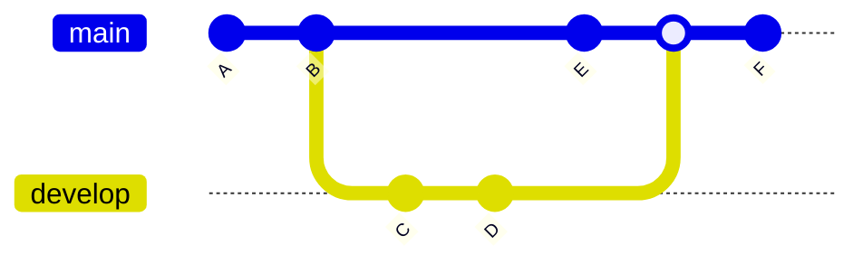
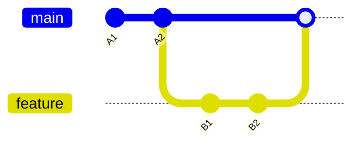
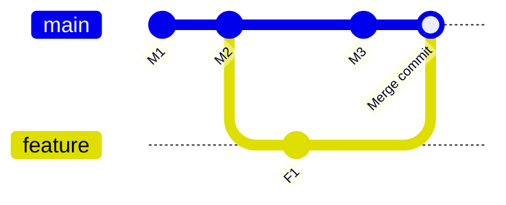
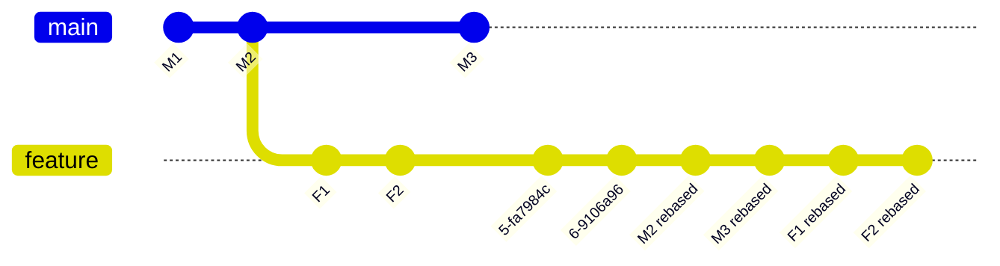
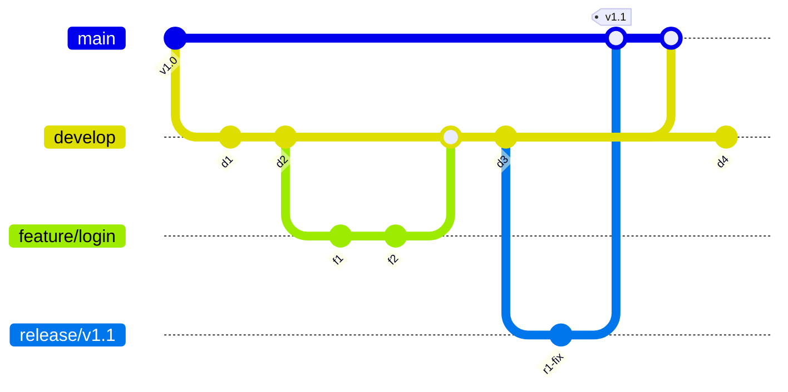
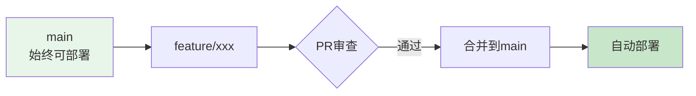
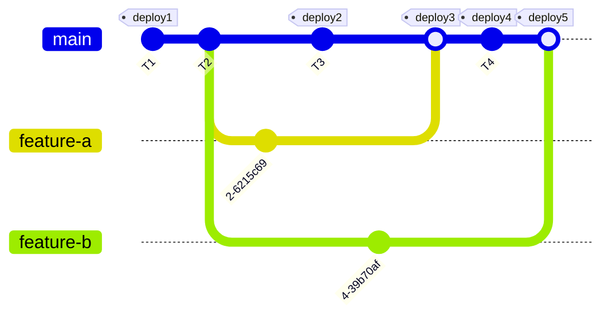

# 第3篇：分支与合并

## 学习目标

- 理解分支的底层原理（指针机制）
- 掌握创建、切换、删除分支的操作
- 理解 fast-forward 与 three-way merge
- 能独立解决合并冲突
- 掌握 rebase 的使用场景

---

## 3.1 分支的本质

### Git 分支是指针

Git 的分支本质上是一个**指向某个 commit 的可移动指针**。每次提交，分支指针自动向前移动。



### 底层原理图

```
┌─────────┐    ┌─────────┐    ┌─────────┐
│ Commit A │───▶│ Commit B │───▶│ Commit C │
│ tree: t1 │    │ tree: t2 │    │ tree: t3 │
└─────────┘    └─────────┘    └─────────┘
      ▲              ▲              ▲
      │              │              │
┌─────────┐    ┌─────────┐    ┌─────────┐
│  main   │    │ develop │    │ feature │
│ pointer │    │ pointer │    │ pointer │
└─────────┘    └─────────┘    └─────────┘
```

> 💡 **关键点**：创建分支只是创建一个 40 字节的指针文件，非常轻量！

---

## 3.2 分支操作实战

### 3.2.1 创建分支

```bash
# 查看当前分支
git branch

# 基于当前 HEAD 创建新分支
git branch feature/search

# 查看所有分支（含远程）
git branch -a
```

### 3.2.2 切换分支

```bash
# 切换到已存在的分支
git checkout feature/search

# 或者使用 switch（Git 2.23+ 新语法）
git switch feature/search

# 创建并切换（一步到位）
git switch -c feature/sort
# 等价于：
git checkout -b feature/sort
```

### 3.2.3 分支重命名

```bash
# 重命名当前分支
git branch -m new-name

# 重命名其他分支
git branch -m old-name new-name
```

### 3.2.4 删除分支

```bash
# 删除已合并的分支
git branch -d feature/done

# 强制删除未合并的分支
git branch -D feature/abandoned

# 删除远程分支
git push origin --delete feature/done
```

---

## 3.3 合并两种方式

### Fast-Forward 合并（快进合并）

**条件**：目标分支的所有提交都在当前分支的"前面"，没有分叉。



**操作**：Git 只需移动 main 指针到 feature 的位置，无需创建新 commit。

```bash
# 合并 feature 到 main（快进模式）
git checkout main
git merge feature
```

**输出结果**：

```
Updating a1b2c3d..f4e5d6c
Fast-forward
 task_manager.py | 2 +-
 1 file changed, 1 insertion(+), 1 deletion(-)
```

---

### Three-Way Merge（三方合并）

**条件**：两个分支有分叉，各自独立演进过。



**操作**：Git 找到两个分支的**最近公共祖先**（LCA），创建新的合并 commit。

```bash
git merge feature/user-auth
```

**输出结果**：

```
Merge made by the 'ort' strategy.
 auth.py | 15 +++++++++++++++
 1 file changed, 15 insertions(+)
```

> 💡 **关键点**：三方合并会生成一个新的合并 commit，有两次父提交。

---

## 3.4 解决合并冲突

### 产生冲突的完整过程

```bash
# 开发者 A 创建分支并修改
git checkout -b feature/priority
sed -i 's/tasks.append/tasks.insert(0/g' task_manager.py
git commit -am "添加优先级支持"

# 开发者 B 同时修改 main
git checkout main
echo "# v2.0 版本" >> task_manager.py
git commit -am "版本号更新"

# 合并时产生冲突
git merge feature/priority
```

**输出结果**：

```
Auto-merging task_manager.py
CONFLICT (content): Merge conflict in task_manager.py
Automatic merge failed; fix conflicts and then commit the result.
```

### 冲突解决的五步法

```
┌──────────────────────────────────────────────┐
│  Step 1：git pull / merge（产生冲突）        │
│              ▼                               │
│  Step 2：git status（查看冲突文件）          │
│              ▼                               │
│  Step 3：编辑文件，解决冲突                  │
│              ▼                               │
│  Step 4：git add <file>（标记已解决）        │
│              ▼                               │
│  Step 5：git commit（完成合并）              │
└──────────────────────────────────────────────┘
```

**查看冲突内容**：

```bash
git diff --name-only --diff-filter=U
```

**编辑解决后**：

```bash
git add task_manager.py
git commit -m "解决合并冲突：整合优先级和版本更新"
```

---

### 使用 mergetool 辅助解决

```bash
# 配置 VS Code 作为合并工具
git config --global merge.tool vscode
git config --global mergetool.vscode.cmd "code --wait --merge $REMOTE $LOCAL $BASE $MERGED"

# 调用合并工具
git mergetool
```

---

## 3.5 Merge vs Rebase

### Rebase（变基）

Rebase 将当前分支的提交"重新应用"到另一个分支的顶端，创造线性历史。



**操作**：

```bash
git checkout feature
git rebase main
```

**结果**：F1、F2 被"重放"到 M3 之后，历史呈线性。

### 变基 vs 合并对比

| 对比项 | Merge | Rebase |
|--------|-------|--------|
| 历史形状 | 保留完整分支痕迹 | 线性历史，更干净 |
| 合并 commit | 产生额外合并 commit | 无额外 commit |
| 冲突处理 | 一次性解决所有冲突 | 可能需要逐个提交解决 |
| 风险 | 安全，可回溯 | 改写历史，已push的分支可能出问题 |
| 黄金法则 | — | **绝不要 rebase 已推送到公共仓库的分支！** |

### 交互式 Rebase

```bash
# 合并最近3个提交，修改提交信息
git rebase -i HEAD~3
```

在编辑器中：

```
pick a1b2c3d 添加用户认证
squash d4e5f6g 修复登录bug  ← 合并到前一个
reword h7i8j9k 实现权限检查  ← 修改提交信息

# 保存后Git打开新编辑器允许修改提交信息
```

---

### Rebase 冲突解决

如果 rebase 过程中遇到冲突：

```bash
# 1. 编辑文件解决冲突
# 2. 标记已解决
git add task_manager.py
# 3. 继续 rebase
git rebase --continue

# 放弃 rebase
git rebase --abort
```

---

## 3.6 分支策略模式

### 3.6.1 Git Flow

适合版本发布节奏明确的项目：



**分支类型**：

| 分支 | 用途 | 生命周期 |
|------|------|----------|
| `main` | 生产分支，始终保持可发布 | 永久 |
| `develop` | 日常开发集成分支 | 永久 |
| `feature/*` | 功能开发 | 临时 |
| `release/*` | 发布前准备 | 临时 |
| `hotfix/*` | 紧急线上修复 | 临时 |

### 3.6.2 GitHub Flow

适合持续部署的 Web 项目：



**规则**：
1. `main` 代码永远可部署
2. 新功能必须从 `main` 新建分支
3. 通过 Pull Request 和 Code Review 后合并
4. 合并后立即部署

### 3.6.3 Trunk-Based Development

适合 DevOps 成熟的团队：



---

## 3.7 本章总结

### 核心命令回顾

| 分类 | 命令 | 作用 |
|------|------|------|
| **查看分支** | `git branch` | 查看本地分支 |
| **查看分支** | `git branch -a` | 查看所有分支 |
| **查看分支** | `git branch -v` | 查看分支最新提交 |
| **创建分支** | `git branch <name>` | 创建分支（不切换） |
| **创建+切换** | `git switch -c <name>` | 创建并切换 |
| **切换分支** | `git switch <name>` | 切换分支 |
| **合并分支** | `git merge <branch>` | 将指定分支合并到当前 |
| **合并分支** | `git merge --no-ff <branch>` | 禁止快进合并 |
| **变基** | `git rebase <branch>` | 将当前分支变基到指定分支 |
| **交互变基** | `git rebase -i HEAD~N` | 交互式编辑提交 |
| **删除分支** | `git branch -d <name>` | 删除本地分支 |
| **删除远程分支** | `git push origin --delete <name>` | 删除远程分支 |

### 最佳实践

```bash
# 每次开发前，从最新的 main 分支创建功能分支
git checkout main
git pull origin main
git switch -c feature/your-feature-name

# 开发完成后，更新本地 main 并合并
git checkout main
git pull origin main
git merge feature/your-feature-name

# 如果遇到冲突，解决后：
git add .
git commit -m "resolve merge conflicts"
git push origin main

# 合并完成后，删除功能分支
git branch -d feature/your-feature-name
git push origin --delete feature/your-feature-name
```

### 下一步预告

在第4篇中，我们将学习：
- 撤销操作（reset / revert / restore）
- 暂存工作进度（stash）
- Git 内部对象模型深入
- 构建自己的 Git 工具

---

**本章完整示例代码**：[git-tutorial-demo/task-manager/](https://github.com/zhangshuo-byte/git-tutorial-demo/tree/main/task-manager)
