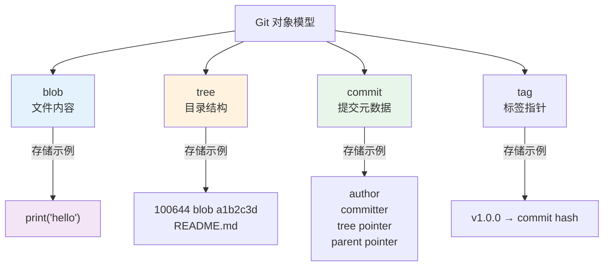
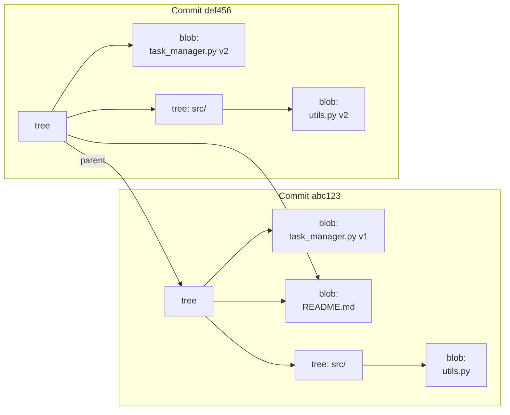
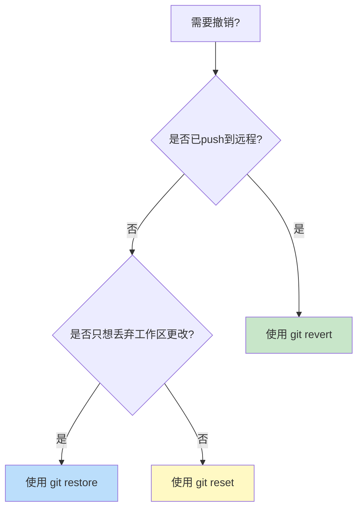
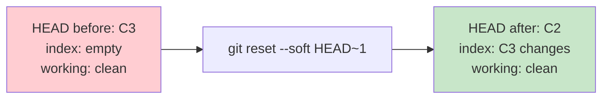
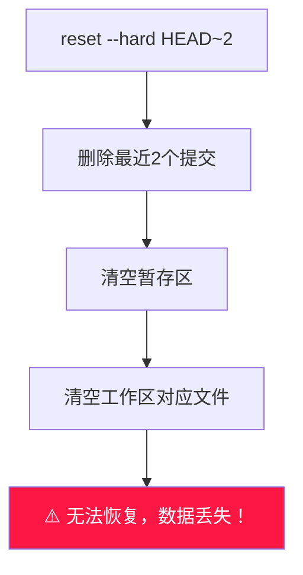
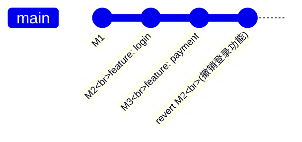
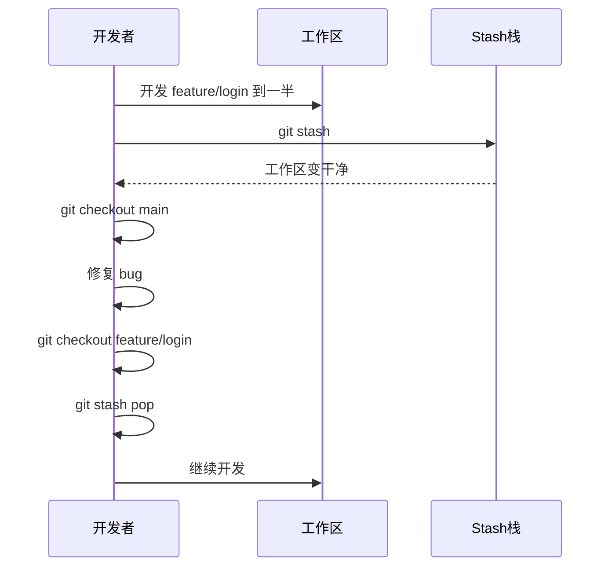
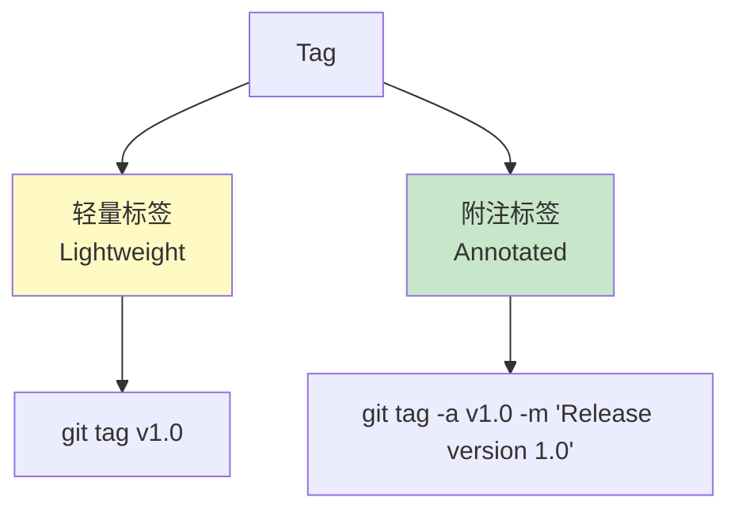

# 第4篇：版本控制进阶

## 学习目标

- 深入理解 Git 内部对象模型
- 掌握 `reset`、`revert`、`restore` 三种撤销方式
- 掌握 `stash` 暂存工作进度
- 学会使用 `tag` 管理版本
- 了解 Git Hooks 和自动化

---

## 4.1 Git 内部对象模型

### 四大对象类型



### 对象关系图



### 查看对象

```bash
# 查看对象类型
git cat-file -t abc123

# 查看对象内容
git cat-file -p abc123

# 计算文件的 SHA-1 哈希
echo "content" | git hash-object --stdin
```

---

## 4.2 三种撤销操作对比

### 总览对比

| 操作 | 影响范围 | 是否改写历史 | 适用场景 |
|------|:--------:|:------------:|----------|
| `git reset` | 本地提交 | ✅ 是 | 撤销本地/commit前的错误 |
| `git revert` | 任意提交 | ❌ 否 | 撤销已push的公共历史 |
| `git restore` | 工作区/暂存区 | ❌ 否 | 丢弃未提交的更改 |



---

## 4.3 git reset —— 重置指针

### 三种模式

#### 1. `--soft`：只移动 HEAD，保留暂存区



```bash
# 撤销最近1次commit，修改保留在暂存区
git reset --soft HEAD~1

# 直接commit恢复（可修改commit message）
git commit -m "修正后的提交信息"
```

#### 2. `--mixed`（默认）：移动 HEAD，清空暂存区

```bash
# 撤销最近1次commit，修改保留在工作区
git reset HEAD~1
git reset --mixed HEAD~1  # 同上
```

#### 3. `--hard`：完全清除（危险！）



```bash
# ⚠️ 危险操作！彻底丢弃最近2个提交
git reset --hard HEAD~2
```

### Reset 恢复方法

```bash
# 使用 reflog 找回丢失的提交
git reflog
git reset --hard abc123  # 恢复到指定提交
```

> ⚠️ **Reflog 是 Git 的后悔药！** 所有 HEAD 移动都记录在 reflog 中。

---

## 4.4 git revert —— 反向提交

### 安全撤销已 push 的公共提交



```bash
# 反向提交（生成新commit来撤销之前的更改）
git revert abc123

# 撤销多个提交
git revert abc123 def456

# 撤销但不自动commit（可手动调整）
git revert -n abc123
```

### 与 reset 的本质区别

```
Reset：时间线回到过去（改写历史）
Revert：时间线继续向前（新增撤销操作）
```

---

## 4.5 git restore —— 丢弃工作区更改

### 场景：想把某个文件恢复到最后一次 commit 的状态

```bash
# 丢弃工作区文件的修改（等同于 git checkout -- file）
git restore task_manager.py

# 取消暂存（把文件从暂存区移回工作区）
git restore --staged task_manager.py

# 同时取消暂存 + 丢弃工作区修改
git restore --staged --worktree task_manager.py

# 恢复到指定提交的状态
git restore --source=abc123 task_manager.py
```

---

## 4.6 git stash —— 暂存工作进度

### 场景：开发到一半，需要紧急切换到其他分支



### 常用命令

```bash
# 暂存当前所有更改
git stash

# 暂存并命名（便于识别）
git stash save "未完成：用户认证模块"

# 只暂存工作区（不含暂存区）
git stash --keep-index

# 查看所有暂存
git stash list

# 查看某个暂存的详情
git stash show stash@{0}

# 应用暂存（保留 stash 记录）
git stash apply stash@{0}

# 应用并删除 stash
git stash pop stash@{0}

# 删除指定 stashed
git stash drop stash@{0}

# 清空所有 stash
git stash clear

# 从 stash 创建分支
git stash branch new-branch stash@{0}
```

---

## 4.7 git tag —— 版本标签

### 标签类型



### 实战操作

```bash
# 创建附注标签（推荐用于正式 release）
git tag -a v1.0.0 -m "Release version 1.0.0: 任务管理核心功能"

# 创建轻量标签（临时标记）
git tag v0.9-beta

# 查看标签列表
git tag

# 搜索标签
git tag -l "v1.*"

# 查看标签详情
git show v1.0.0

# 推送标签到远程
git push origin v1.0.0

# 推送所有标签
git push origin --tags

# 删除本地标签
git tag -d v0.9-beta

# 删除远程标签
git push origin --delete v0.9-beta
```

---

## 4.8 Git Hooks —— 自动化钩子

### Hook 类型

```
.git/hooks/
├── pre-commit            # commit 前执行
├── prepare-commit-message # 准备 commit message 时
├── post-commit           # commit 后执行
├── pre-push              # push 前执行
├── pre-receive           # 服务端收到 push 时
├── update                # 服务端更新引用时
└── post-receive          # 服务端推送完成后
```

### 实战示例：pre-commit 检查代码

```bash
# 创建 pre-commit hook
cat > .git/hooks/pre-commit << 'EOF'
#!/bin/sh

echo "正在检查代码格式..."

# 检查是否有 console.log
if git diff --cached --name-only | xargs grep -l "console\.log"; then
    echo "❌ 错误：提交中不能包含 console.log"
    exit 1
fi

# 执行 Python 语法检查
python_files=$(git diff --cached --name-only --diff-filter=ACM | grep '\.py$')
if [ -n "$python_files" ]; then
    echo "$python_files" | xargs python -m py_compile
    if [ $? -ne 0 ]; then
        echo "❌ 错误：Python 语法检查失败"
        exit 1
    fi
fi

echo "✅ 检查通过！"
exit 0
EOF

# 给钩子执行权限
chmod +x .git/hooks/pre-commit
```

### Husky（推荐）

用于管理 Git hooks 的 Node.js 工具：

```bash
npm install husky --save-dev

# package.json 中添加
{
  "husky": {
    "hooks": {
      "pre-commit": "npm run lint && npm test",
      "pre-push": "npm run build"
    }
  }
}
```

---

## 4.9 .gitignore 深入

### 常用模式

```gitignore
# 注释

# 忽略所有 .log 文件
*.log

# 但 track.log 除外
!important.log

# 忽略整个目录
node_modules/
__pycache__/
dist/

# 忽略根目录下的文件
/config.json

# 忽略所有子目录下的 .DS_Store
**/.DS_Store

# 忽略目录但保留目录本身（如 uploads/）
uploads/*
!uploads/.gitkeep
```

### 全局 .gitignore

```bash
# 配置全局忽略
git config --global core.excludesfile ~/.gitignore_global

# 编辑全局忽略文件
echo ".DS_Store" >> ~/.gitignore_global
echo "*.swp" >> ~/.gitignore_global
echo "Thumbs.db" >> ~/.gitignore_global
```

---

## 4.10 本章总结

### 撤销操作速查表

| 命令 | 撤销范围 | 历史改写 | 危险性 |
|------|:--------:|:--------:|:------:|
| `git restore <file>` | 工作区文件 | ❌ | 低 |
| `git restore --staged <file>` | 暂存区文件 | ❌ | 低 |
| `git reset --soft HEAD~N` | 最近 N 个 commit | ✅ | 中 |
| `git reset --mixed HEAD~N` | 最近 N 个 commit | ✅ | 中 |
| `git reset --hard HEAD~N` | 最近 N 个 commit | ✅ | 高 |
| `git revert <commit>` | 指定 commit | ❌ | 低 |

### Reflog —— 永恒后悔药

```bash
# 查看 HEAD 的所有操作记录
git reflog

# 恢复到某次操作的状态
git reset --hard HEAD@{2}
```

### 下一步预告

在第5篇中，我们将学习：
- 分支策略（Git Flow、GitHub Flow）
- Trunk-Based Development
- 大型项目分支管理
- CI/CD 与 Git 的集成
