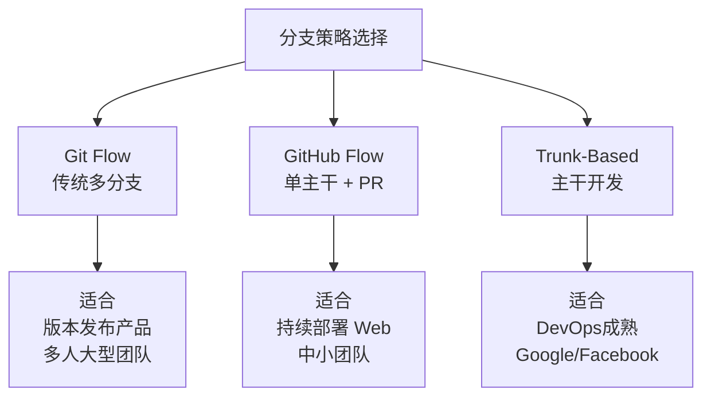
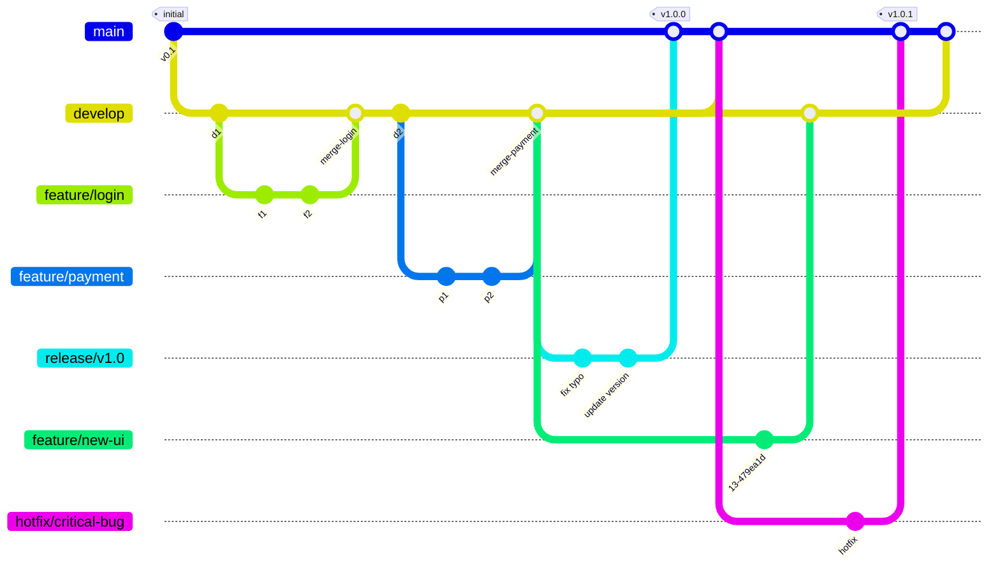
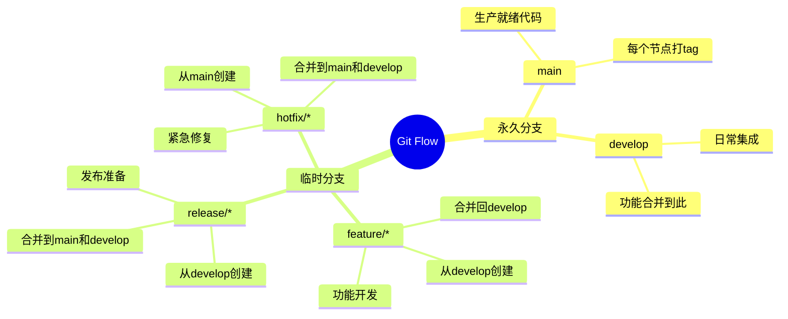
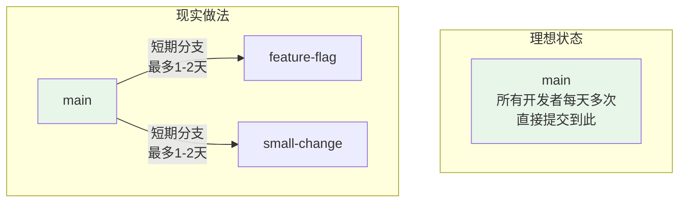
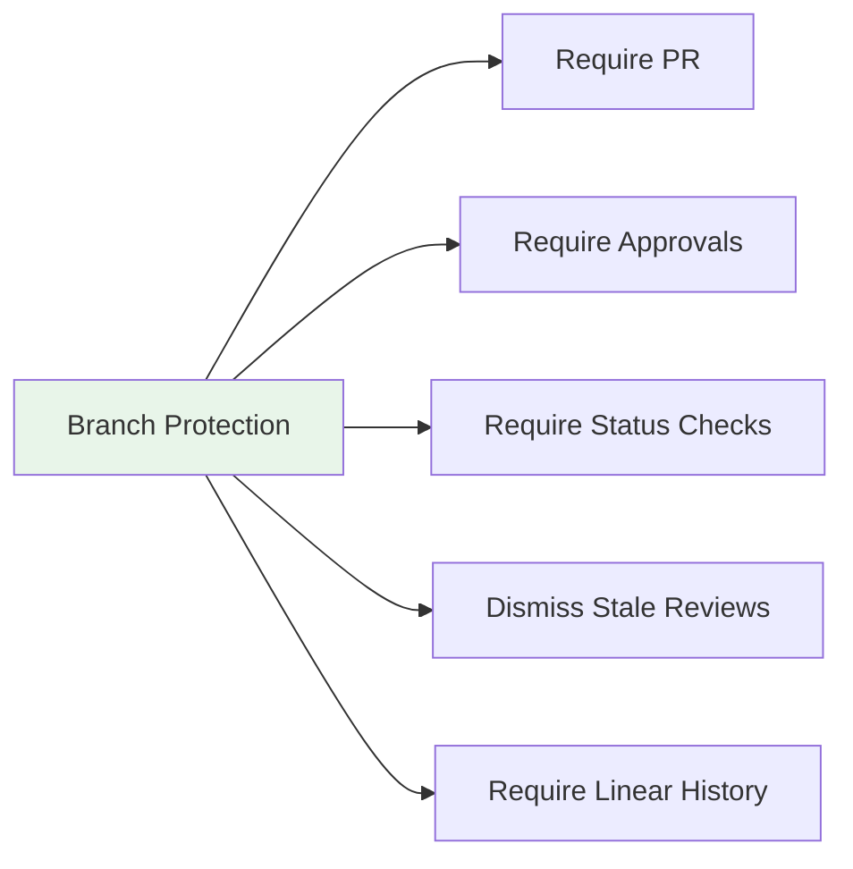
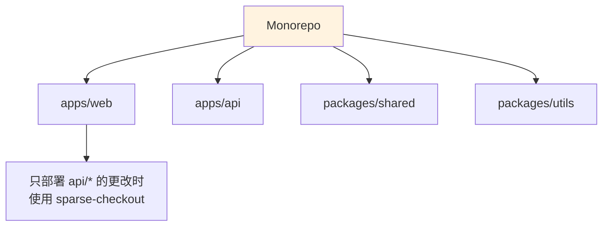

# 第5篇：分支策略高级篇

## 学习目标

- 理解不同分支策略的优缺点
- 能根据团队规模选择合适的策略
- 掌握 Trunk-Based Development
- 能在 CI/CD 环境中应用合适的分支模型
- 学会管理大型项目的分支策略

---

## 5.1 三大分支策略对比



---

## 5.2 Git Flow 深入

### 完整分支模型



### 各分支职责



### 实操流程

```bash
# ==================== 开始新功能 ====================
# 1. 从 develop 创建功能分支
git checkout develop
git pull origin develop
git checkout -b feature/user-profile

# 2. 开发...开发...开发...
echo "def get_user_profile(): ..." > user.py
git add user.py
git commit -m "实现用户资料展示功能"

# 3. 功能完成，更新 develop 并合并
git checkout develop
git pull origin develop
git merge feature/user-profile
git push origin develop

# 4. 删除功能分支
git branch -d feature/user-profile
git push origin --delete feature/user-profile

# ==================== 准备发布 ====================
# 5. 从 develop 创建 release 分支
git checkout develop
git checkout -b release/v1.1.0

# 6. 修复 bug（只允许小修，不允许加新功能）
sed -i 's/repositories/repository/g' user.py
git commit -am "修复typo"
echo "__version__ = '1.1.0'" > version.py
git commit -am "更新版本号到1.1.0"

# 7. 合并到 main 并打 tag
git checkout main
git merge release/v1.1.0
git tag -a v1.1.0 -m "Release version 1.1.0"
git push origin main --tags

# 8. 同步回 develop
git checkout develop
git merge release/v1.1.0
git push origin develop

# 9. 删除 release 分支
git branch -d release/v1.1.0
```

---

## 5.3 GitHub Flow

### 极简模型

```mermaid
flowchart TD
    A["main<br/>始终可部署"] --> B["创建功能分支<br/>feature/xxx"]
    B --> C["Push到远程"]
    C --> D["创建Pull Request"]
    D --> E["Code Review"]
    E --> F{"通过?}" 
    F -->|"是"| G["合并到main"]
    F -->|"否"| H["继续修改"]
    H --> C
    G --> I["自动部署到生产"]
    
    style A fill:#e8f5e9
    style G fill:#c8e6c9
    style I fill:#a5d6a7
```

### 实操流程

```bash
# === 保护 main 分支 ===
# 在 GitHub 设置：Settings → Branches → Add rule
# - Require a pull request before merging
# - Require approvals: 1

# === 日常工作流 ===

# 1. 从 main 创建分支
git checkout main
git pull origin main
git checkout -b fix-login-error

# 2. 修复问题
sed -i 's/== None/is None/g' auth.py
git add auth.py
git commit -m "修复身份验证逻辑错误"

# 3. Push 并创建 PR
git push -u origin fix-login-error
# 访问 PR 链接（GitHub 会在push后显示）

# 4. Review 通过后，在 GitHub 上点击 "Merge pull request"
# 5. 本地清理
git checkout main
git pull origin main
git branch -d fix-login-error
```

---

## 5.4 Trunk-Based Development

### 核心理念



### 实操方案

#### 方案A：直接提交到 Main

```bash
# 每天的工作流程
git checkout main
git pull origin main

# 小步提交（每完成一个小任务立刻commit+punch）
echo "add unit test for auth" >> tests.py
git add tests.py
git commit -m "增加认证模块单元测试"
git push origin main

# 多次小提交，一天内多次push
```

#### 方案B：特性开关（Feature Flags）

```python
# config.py
FEATURES = {
    'new_dashboard': False,  # 开发中设为 False
    'user_avatar': True,     # 已上线设为 True
}

# app.py
from config import FEATURES

def show_dashboard():
    if FEATURES['new_dashboard']:
        return render_new_dashboard()
    else:
        return render_old_dashboard()
```

```bash
# 开发未完成也能 push 到 main，因为功能默认关闭
git add config.py app.py
git commit -m "新增仪表板（功能开关关闭中）"
git push origin main

# 开发完成后，开启开关
sed -i "s/'new_dashboard': False/'new_dashboard': True/" config.py
git commit -am "开启新仪表板功能"
git push origin main
```

---

### 方案C：Fork + PR

```bash
# 1. Fork 仓库到个人账号（在 GitHub 上操作）

# 2. 克隆自己的 fork
git clone git@github.com:yourname/project.git
cd project

# 3. 添加上游远程
git remote add upstream git@github.com:company/project.git

# 4. 从最新 main 创建分支
git checkout main
git pull upstream main
git checkout -b feature/small-fix

# 5. 提交、推送、创建 PR
echo "..." > fix.py
git add fix.py
git commit -m "修复小问题"
git push origin feature/small-fix

# 6. 在 GitHub 上创建 PR 到主仓库的 main 分支
```

---

## 5.5 保护分支配置

### GitHub Branch Protection 规则



### 实战配置

```
# .github/branch-protection.yml（注意：原生需要手动在Settings中设置）
# 以下展示典型配置：

保护分支: main
├── Require a pull request before merging
│   ├── Require approvals: 1
│   └── Dismiss stale pull request approvals when new commits are pushed
├── Require status checks to pass before merging
│   ├── Require branches to be up to date before merging
│   └── Status checks: ci/build, ci/test
├── Require conversation resolution before merging
└── Include administrators
```

---

## 5.6 Monorepo 协作策略

### 当项目规模增长



### 稀疏检出（Sparse Checkout）

```bash
# 只检出 apps/web 目录
git clone --no-checkout git@github.com:company/monorepo.git
cd monorepo
git sparse-checkout set apps/web
git checkout main
```

---

## 5.7 分支策略选型决策树

```mermaid
flowchart TD
    Q1{团队规模?}
    Q1 -->|大型 10+| Q2{是否需支持<br/>多版本并存?}
    Q1 -->|中小型 2-10| Q3{是否需<br/>持续部署?}
    
    Q2 -->|是| A1[Git Flow<br/>严格的分支模型]
    Q2 -->|否| A2[GitHub Flow<br/>单主干 + PR]
    
    Q3 -->|是| Q4{DevOps成熟度?}
    Q3 -->|否| A3<br/>[GitHub Flow]
    
    Q4 -->|高| A4[Trunk-Based<br/>+ 特性开关]
    Q4 -->|中| A5[GitHub Flow<br/>+ Feature Branch]
    
    style A1 fill:#e3f2fd
    style A2 fill:#e8f5e9
    style A4 fill:#c8e6c9
```

### 各策略对比表

| 维度 | Git Flow | GitHub Flow | Trunk-Based |
|------|----------|-------------|-------------|
| 复杂度 | ⭐⭐⭐⭐ | ⭐⭐ | ⭐ |
| 分支数量 | 多 | 少 | 极少 |
| 发布节奏 | 版本迭代 | 持续部署 | 持续部署 |
| 团队协作成本 | 高 | 中 | 低 |
| 审查强度 | 中 | 高 | 高（小步提交） |
| 回滚难度 | 低 | 中 | 高（需完善 CI） |
| 适用规模 | 大型 | 中小型 | 中大型（DevOps成熟） |

---

## 5.8 本章总结

### 分支策略选择检查清单

- [ ] 明确团队规模（影响分支复杂度选择）
- [ ] 确定发布模式（版本发布 vs 持续部署）
- [ ] 评估 CI/CD 成熟度（影响测试和部署策略）
- [ ] 选择合适的分支模型
- [ ] 配置保护规则
- [ ] 团队培训和文档

### 最佳实践

```bash
# 无论哪种策略，都要遵循：

# 1. 小步提交（原子性更改）
git add specific-file.py
git commit -m "具体描述修改内容"

# 2. 频繁同步（避免长期分支分化）
git fetch origin
git rebase origin/main

# 3. 保持主线稳定（main 永远可部署）
git push origin main --force-with-lease  # 安全的强制推送

# 4. 及时清理分支
git branch --merged main | grep -v '\* main$' | xargs git branch -d

# 5. 记录合并 git log --graph --oneline --all
```

### 下一步预告

在第6篇中，我们将学习：
- CI/CD 与 Git 集成
- GitHub Actions 实战
- 代码审查最佳实践
- 完整的项目工作流模拟
