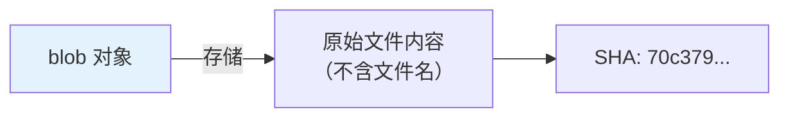
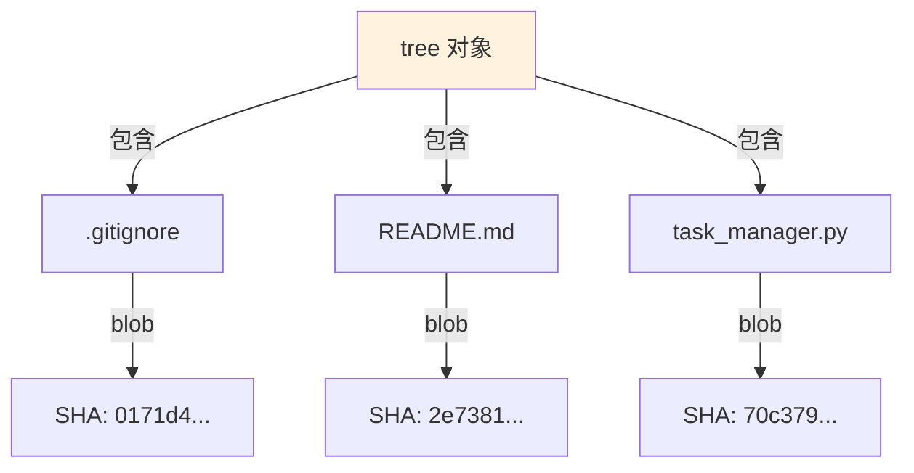
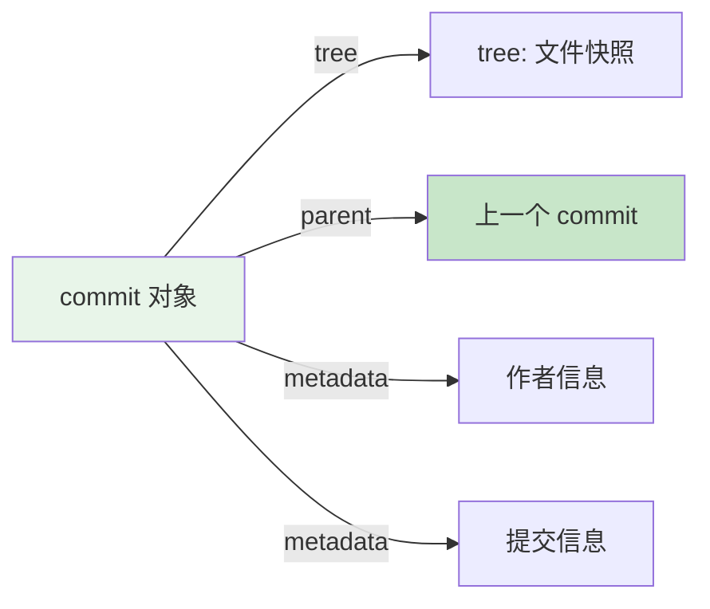
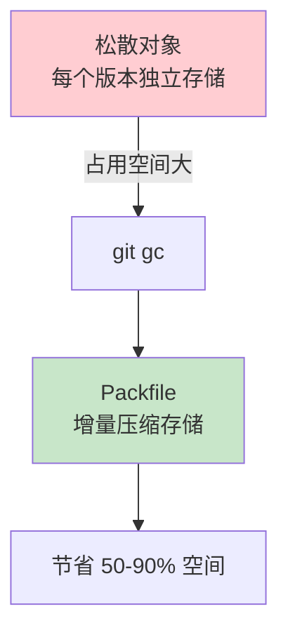
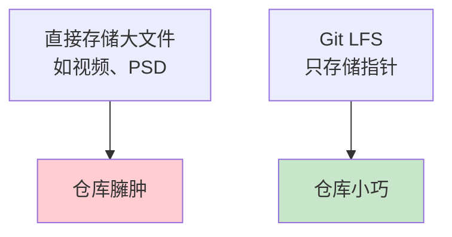

# 第6篇：Git 底层原理

## 学习目标

- 深入理解 Git 的存储机制
- 理解 HEAD、refs、objects 的层级关系
- 掌握 reflog 的恢复原理
- 能手动操作 Git 底层命令
- 了解 packfile 和垃圾回收机制

---

## 6.1 .git目录结构

```bash
# 查看 .git 目录构成
tree .git/
```

### 目录与文件详解

```mermaid
graph TD
    subgraph ".git 目录"
        A[HEAD] -->|"指向当前分支"| B["ref: refs/heads/main"]
        C[refs/] --> C1[heads/]
        C --> C2[tags/]
        C --> C3[remotes/]
        D[objects/] --> D1[pack/]
        D --> D2[info/]
        D --> D3[xx/ 哈希前两位]
        E[config] -->|"仓库配置"| E1[user]
        E2[hooks/]
        F[index] -->|"暂存区元数据"| 
    end
    
    style A fill:#e3f2fd
    style D fill:#fff3e0
```

### 核心文件说明

| 文件/目录 | 作用 |
|-----------|------|
| `HEAD` | 当前检出的分支指针（如 `ref: refs/heads/main`） |
| `refs/heads/` | 所有本地分支的指针 |
| `refs/tags/` | 所有标签 |
| `refs/remotes/` | 远程仓库的跟踪分支 |
| `objects/` | 所有 Git 对象的存储目录 |
| `index` | 暂存区索引（二进制） |
| `config` | 仓库级别配置（优先级高于全局） |
| `hooks/` | 钩子脚本 |
| `packed-refs` | 打包的引用文件（优化性能） |

---

## 6.2 四大对象模型详解

### blob —— 文件内容

```bash
# 创建一个 blob 对象
echo "print('hello world')" | git hash-object -w --stdin
# 输出：70c379b63ffa0795fdbfbc128e5a28183998f5a0

# 查看 blob 内容
git cat-file -p 70c379b63ffa0795fdbfbc128e5a28183998f5a0

# 验证：同一内容总是产生相同的 SHA-1
echo "print('hello world')" | git hash-object --stdin
# 输出相同的哈希
```



### tree —— 目录结构

```bash
# 查看 HEAD 的 tree
git cat-file -p HEAD^{tree}
```

**输出示例**：

```
100644 blob 0171d4f98c8e5a...    .gitignore
100644 blob 2e7381fb8c18e3...    README.md
100644 blob 70c379b63ffa07...    task_manager.py
```



### commit —— 提交快照

```bash
# 查看 commit 对象
git cat-file -p HEAD
```

**输出**：

```
tree 01d8e9eb8d6f9c11064b2d2d76be5cf95f5d9e60
parent abc123def456789...
author zhangshuo-byte <email> 1628500000 +0800
committer zhangshuo-byte <email> 1628500000 +0800

feat: 添加任务完成功能
```



### tag —— 版本标签

```bash
git cat-file -p v1.0.0
```

**附注标签**：

```
object 01d8e9eb8d6f9c11064b2d2d76be5cf95f5d9e60
type commit
tag v1.0.0
tagger zhangshuo-byte <email> 1628500000 +0800

Release version 1.0.0
```

---

## 6.3 HEAD、refs 与 objects 的关系

### 层级关系图

```mermaid
graph TD
    H["HEAD<br/>符号引用"] -->|"指向"|"refs/heads/main<br/>分支指针"
    H -->|"也可指向"|"refs/heads/feature<br/>detached HEAD"
    
    RM["refs/remotes/origin/main<br/>远程跟踪分支"]
    
    R["refs/tags/v1.0.0<br/>标签"]
    
    MAIN["refs/heads/main"] -->|"指向 commit"| C1["abc123<br/>commit 对象"]
    
    FT["refs/heads/feature"] -->|"指向 commit"| C1
    
    C1 -->|"parent"| C2["def456<br/>上一个 commit"]
    C1 -->|"tree"| T1["tree 对象"]
    
    R -->|"指向"| C1
    
    T1 -->|"包含"| B1["blob: README.md"]
    T1 -->|"包含"| B2["blob: task_manager.py"]
    
    style H fill:#e3f2fd
    style C1 fill:#c8e6c9
```

### 查看 HEAD

```bash
cat .git/HEAD
# 输出：ref: refs/heads/main

# 查看指针
cat .git/refs/heads/main
# 输出：abc123def456789...
```

### detached HEAD 状态

```bash
# 切换到特定 commit（而非分支）
git checkout abc123
```

```
警告：您正处于“分离 HEAD”状态。您可以查看、做试验性修改并提交，
并且您可以从当前状态提交新的分支，切换时不会丢失任何更改。

HEAD 目前位于 abc123 添加任务完成功能
```

**挽救方法**：

```bash
# 创建新分支保存当前状态
git checkout -b rescue-branch

# 或回到分支
git checkout main
```

---

## 6.4 引用日志（Reflog）

### reflog 的作用

```bash
# 查看 HEAD 的操作历史
git reflog
```

**输出**：

```
abc123d HEAD@{0}: commit: 添加任务完成功能
def456e HEAD@{1}: checkout: moving from main to feature/login
789abcd HEAD@{2}: merge feature/login: Merge made by the 'ort' strategy.
ef01234 HEAD@{3}: pull: Fast-forward
```


### 恢复误删的提交

```bash
# 当前状态（误操作前）
git log --oneline
# abc123 (HEAD -> main) 添加任务完成功能
# def456 添加用户认证

# 😱 不小心 hard reset 了
git reset --hard def456

# 😱 abc123 的提交"丢了"
git log --oneline
# def456 (HEAD -> main) 添加用户认证

# ✅ 用 reflog 找回
git reflog
# def456 HEAD@{0}: reset: moving to def456
# abc123 HEAD@{1}: commit: 添加任务完成功能  <-- 找到了！

# 恢复
git reset --hard abc123
# HEAD 现在位于 abc123 添加任务完成功能
```

---

## 6.5 压缩对象（Packfiles）

### 为什么需要打包？

Git 初期每个文件版本都以独立 blob 存储，相似文件重复存储浪费空间。



### 手动执行垃圾回收

```bash
# 查看仓库大小
git count-objects -v

# 执行垃圾回收
git gc

# 更彻底的回收（耗时长）
git gc --aggressive --prune=now
```

**输出示例**：

```
Enumerating objects: 15, done.
Counting objects: 100% (15/15), done.
Delta compression using up to 24 threads
Compressing objects: 100% (11/11), done.
Writing objects: 100% (15/15), done.
Total 15 (delta 3), reused 0 (delta 0), pack-reused 0 (from 0)
```

---

## 6.6 底层命令实战场景

### 场景1：手动创建提交

```bash
# 1. 写入 blob
echo "console.log('hello');" | git hash-object -w --stdin
# 输出：0171d4f98c8e5a...

# 2. 创建 tree
git update-index --add --cacheinfo 100644,0171d4f98c8e5a...,hello.js

# 3. 写入 tree
git write-tree
# 输出：9e8e7d6c5b4a...

# 4. 创建 commit
echo "Manual commit" | git commit-tree 9e8e7d6c5b4a... -m "手动创建提交"
```

### 场景2：查看对象关系

```bash
# 查看某个 blob 出现在哪些 tree 中
git log --all --find-object=0171d4f98c8e5a...

# 查看哪些 commit 包含特定文件
git log --all --oneline -- hello.js
```

---

## 6.7 Git 大文件存储（LFS）

### 为什么需要 Git LFS？



### 安装与配置

```bash
# 安装 Git LFS
git lfs install

# 跟踪大文件类型
git lfs track "*.psd"
git lfs track "*.mp4"
git lfs track "assets/videos/*"

# 查看跟踪模式
git lfs track

# 提交 .gitattributes
git add .gitattributes
git commit -m "配置 Git LFS 跟踪大文件"
```

### .gitattributes 文件内容

```
*.psd filter=lfs diff=lfs merge=lfs -text
*.mp4 filter=lfs diff=lfs merge=lfs -text
assets/videos/* filter=lfs diff=lfs merge=lfs -text
```

---

## 6.8 Git 性能优化

### 浅克隆（Shallow Clone）

```bash
# 只拉取最近 1 次提交历史
git clone --depth 1 git@github.com:user/large-repo.git

# 后续可增加历史深度
git fetch --depth=10
git fetch --unshallow  # 获取完整历史
```

### 部分克隆（Partial Clone）

```bash
# 不下载大文件（按需下载）
git clone --filter=blob:none git@github.com:user/huge-repo.git

# 查看需要下载的文件
git sparse-checkout init
git sparse-checkout set src/ docs/
```

---

## 6.9 高级搜索与查询

### 按内容搜索历史

```bash
# 在所有历史中搜索字符串 "password"
git log -p --all -S "password"

# 在所有历史中使用正则搜索
git log -p --all -G "ssh.*key"

# 查看某文件的每一行最后修改者
git blame task_manager.py
```

**blame 输出**：

```
^a1b2c3d (zhangshuo-byte 2025-07-10 10:00:00 +0800 1) # task_manager.py
^a1b2c3d (zhangshuo-byte 2025-07-10 10:00:00 +0800 2) 
^a1b2c3d (zhangshuo-byte 2025-07-10 10:00:00 +0800 3) class TaskManager:
def456a (zhangshuo-byte 2025-07-12 14:30:00 +0800 4)     def __init__(self):
...
```

---

## 6.10 本章总结

### 关键概念总结

| 概念 | 说明 |
|------|------|
| **blob** | 文件内容的只读快照 |
| **tree** | 目录结构的快照 |
| **commit** | 父指针 + tree + 元数据 |
| **HEAD** | 当前分支的符号引用 |
| **refs/** | 分支/标签的指针文件 |
| **reflog** | HEAD 操作历史（恢复神器） |
| **packfile** | 增量压缩的对象存储 |

### 关键命令速查

| 命令 | 底层用途 |
|------|----------|
| `git hash-object` | 计算/写入 blob |
| `git cat-file -p <hash>` | 查看对象内容 |
| `git cat-file -t <hash>` | 查看对象类型 |
| `git update-index` | 操作暂存区 |
| `git write-tree` | 创建 tree 对象 |
| `git commit-tree` | 创建 commit 对象 |
| `git reflog` | 查看操作历史 |
| `git gc` | 垃圾回收与打包 |

### 下一步预告

在第7篇中，我们将：
- 模拟完整的团队项目开发
- 搭建真实的 GitHub CI/CD 流水线
- 从头到尾演练协作全流程
- 总结避坑指南与最佳实践
