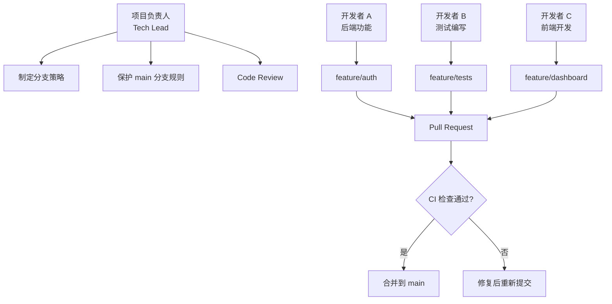
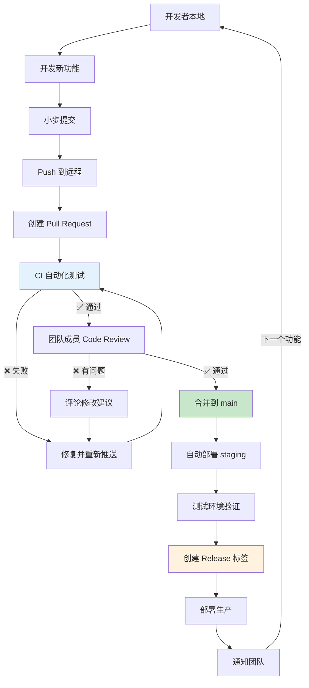

# 第7篇：项目实战与最佳实践

## 学习目标

- 完整体验真实项目的开发流程
- 搭建 GitHub Actions CI/CD 流水线
- 掌握团队协作的核心规范
- 学会编写实用的 Git Hook
- 总结避坑清单与最佳实践

---

## 7.1 项目启动：从零搭建示例项目

### 场景：构建一个 Web API 项目

我们将构建一个 **"任务管理 API"** ，使用 Python Flask：

```bash
# 1. 创建项目
mkdir task-api
cd task-api

# 2. 初始化 Git
git init

# 3. 创建虚拟环境
python -m venv venv
source venv/bin/activate  # Windows: venv\Scripts\activate

# 4. 安装依赖
pip install flask pytest

# 5. 配置 .gitignore
cat > .gitignore << 'EOF'
# Python
__pycache__/
*.pyc
*.pyo
.venv/
venv/
.env

# IDE
.idea/
.vscode/
*.swp

# 构建产物
dist/
build/
*.egg-info/

# 测试产物
.pytest_cache/
htmlcov/
.coverage

# 数据库
*.db
*.sqlite3

# 系统
.DS_Store
Thumbs.db
EOF
```

### 6.2 项目结构

```
task-api/
├── .github/
│   └── workflows/
│       └── ci.yml
├── src/
│   ├── __init__.py
│   ├── app.py
│   ├── models.py
│   └── routes.py
├── tests/
│   ├── __init__.py
│   └── test_app.py
├── .gitignore
├── requirements.txt
├── README.md
└── LICENSE
```

---

## 7.2 团队角色与分工



---

## 7.3 第一次提交：项目脚手架

```bash
# 创建主要文件
touch src/__init__.py src/app.py src/models.py src/routes.py
touch tests/__init__.py tests/test_app.py
touch requirements.txt LICENSE
```

### src/app.py

```python
from flask import Flask

app = Flask(__name__)

@app.route('/')
def index():
    return {'message': 'Welcome to Task API', 'version': '0.1.0'}

if __name__ == '__main__':
    app.run(debug=True)
```

### src/models.py

```python
class Task:
    def __init__(self, title, description='', priority='medium'):
        self.id = None
        self.title = title
        self.description = description
        self.priority = priority
        self.completed = False
    
    def to_dict(self):
        return {
            'id': self.id,
            'title': self.title,
            'description': self.description,
            'priority': self.priority,
            'completed': self.completed
        }
```

### tests/test_app.py

```python
import pytest
from src.app import app

@pytest.fixture
def client():
    app.config['TESTING'] = True
    with app.test_client() as client:
        yield client

def test_index(client):
    rv = client.get('/')
    assert rv.status_code == 200
    json_data = rv.get_json()
    assert json_data['message'] == 'Welcome to Task API'
```

### requirements.txt

```
flask>=2.3.0
pytest>=7.4.0
```

```bash
# 首次提交
git add .
git commit -m "feat: 项目脚手架初始化
                  
- 添加 Flask 应用基础结构
- 定义 Task 模型
- 配置测试环境
- 添加依赖管理文件"
```

---

## 7.4 配置 GitHub Actions CI

### .github/workflows/ci.yml

```yaml
name: Task API CI

on:
  push:
    branches: [ main ]
  pull_request:
    branches: [ main ]

jobs:
  test:
    runs-on: ubuntu-latest
    strategy:
      matrix:
        python-version: ['3.9', '3.10', '3.11']

    steps:
    - uses: actions/checkout@v3

    - name: Set up Python ${{ matrix.python-version }}
      uses: actions/setup-python@v4
      with:
        python-version: ${{ matrix.python-version }}

    - name: Cache pip packages
      uses: actions/cache@v3
      with:
        path: ~/.cache/pip
        key: ${{ runner.os }}-pip-${{ hashFiles('requirements.txt') }}

    - name: Install dependencies
      run: |
        python -m pip install --upgrade pip
        pip install -r requirements.txt
        pip install flake8

    - name: Lint with flake8
      run: |
        flake8 src/ --count --select=E9,F63,F7,F82 --show-source --statistics

    - name: Run tests
      run: |
        pytest tests/ -v --tb=short

    - name: Build check
      run: |
        python -c "from src.app import app; print('App loads successfully!')"
```

推送 CI 配置：

```bash
git add .github/workflows/ci.yml
git commit -m "ci: 配置 GitHub Actions 自动化测试"
git push -u origin main
```

> 📸 **截图点**：CI 运行成功后的 GitHub Actions 页面

---

## 7.5 功能开发实战

### 场景：开发者A实现认证功能

```bash
# 1. 从 main 创建功能分支
git checkout main
git pull origin main
git checkout -b feature/user-auth

# 2. 实现功能
cat > src/routes.py << 'EOF'
from functools import wraps
from flask import request, jsonify

def require_auth(f):
    @wraps(f)
    def decorated(*args, **kwargs):
        auth = request.headers.get('Authorization')
        if not auth or auth != 'Bearer valid-token':
            return jsonify({'error': 'Unauthorized'}), 401
        return f(*args, **kwargs)
    return decorated

def register_routes(app):
    import uuid
    tasks = []
    
    @app.route('/api/tasks', methods=['GET'])
    @require_auth
    def list_tasks():
        return jsonify([task.to_dict() for task in tasks])

    @app.route('/api/tasks', methods=['POST'])
    @require_auth
    def create_task():
        data = request.get_json()
        from src.models import Task
        task = Task(data.get('title'), data.get('description', ''))
        task.id = str(uuid.uuid4())
        tasks.append(task)
        return jsonify(task.to_dict()), 201

    @app.route('/api/tasks/<task_id>/complete', methods=['POST'])
    @require_auth
    def complete_task(task_id):
        for task in tasks:
            if task.id == task_id:
                task.completed = True
                return jsonify(task.to_dict())
        return jsonify({'error': 'Task not found'}), 404
EOF

# 3. 添加测试
cat > tests/test_routes.py << 'EOF'
import pytest
import json
from src.app import app

@pytest.fixture
def client():
    app.config['TESTING'] = True
    with app.test_client() as client:
        yield client

def test_create_task(client):
    rv = client.post('/api/tasks',
                     headers={'Authorization': 'Bearer valid-token'},
                     data=json.dumps({'title': 'Test'}),
                     content_type='application/json')
    assert rv.status_code == 201
    assert rv.get_json()['title'] == 'Test'

def test_list_tasks_unauthorized(client):
    rv = client.get('/api/tasks')
    assert rv.status_code == 401

def test_list_tasks(client):
    rv = client.get('/api/tasks', headers={'Authorization': 'Bearer valid-token'})
    assert rv.status_code == 200
EOF

# 4. 本地测试
pytest tests/ -v

# 5. 提交并推送
git add .
git commit -m "feat: 实现任务管理 API 和认证机制

新增功能：
- GET /api/tasks 获取任务列表
- POST /api/tasks 创建新任务  
- POST /api/tasks/<id>/complete 标记任务完成
- 基于 Bearer Token 的认证机制
- 完整的单元测试"
```

---

## 7.6 Code Review 与合并

### 模拟 GitHub 上的 PR 流程

```bash
# 推送功能分支
git push -u origin feature/user-auth

# 假设另一位开发者发现了问题，提出 review 意见
# [Review] 返回 201 时需要设置 Location header
```

**修改意见**：

```python
# routes.py 中添加 Location header
@app.route('/api/tasks', methods=['POST'])
@require_auth
def create_task():
    data = request.get_json()
    from src.models import Task
    task = Task(data.get('title'), data.get('description', ''))
    task.id = str(uuid.uuid4())
    tasks.append(task)
    response = jsonify(task.to_dict())
    response.status_code = 201
    response.headers['Location'] = f'/api/tasks/{task.id}'
    return response
```

```bash
# 修改后更新 PR
git add src/routes.py
git commit -m "fix: 创建任务接口添加 Location header"
git push origin feature/user-auth

# Review 通过后，在 GitHub 上合并 PR
```

> 📸 **截图点**：GitHub PR 的描述、Review 对话框、合并按钮

---

## 7.7 标签与版本发布

### 创建版本标签

```bash
# 合并后的 main 分支
git checkout main
git pull origin main

# 创建附注标签
git tag -a v1.0.0 -m "Release version 1.0.0

功能特性：
- 任务 CRUD 操作
- Bearer Token 认证
- 完整的单元测试
- GitHub Actions 自动化 CI"

# 推送标签
git push origin v1.0.0
```

### GitHub Release（可选）

```bash
# 安装 GitHub CLI（如已安装）
gh release create v1.0.0 \
  --title "v1.0.0: 任务管理 API 首发" \
  --notes "完整任务管理 API，包括认证、CRUD、自动化测试" \
  --target main
```

> 📸 **截图点**：GitHub Release 发布页面

---

## 7.8 Git Hook：自动化代码检查

### 本地 pre-commit Hook

```bash
cat > .git/hooks/pre-commit << 'EOF'
#!/bin/bash
# 颜色定义
RED='\033[0;31m'
GREEN='\033[0;32m'
NC='\033[0m' # No Color

echo "🔍 正在执行提交前检查..."

# 检查 Python 语法
echo "  ▶ 检查 Python 语法..."
python_files=$(git diff --cached --name-only --diff-filter=ACM | grep '\.py$')
if [ -n "$python_files" ]; then
    for file in $python_files; do
        python -m py_compile "$file" 2>/dev/null
        if [ $? -ne 0 ]; then
            echo -e "${RED}❌ $file 语法检查失败${NC}"
            exit 1
        fi
    done
    echo -e "  ${GREEN}✓ Python 语法检查通过${NC}"
fi

# 检查是否明文密码
echo "  ▶ 扫描敏感信息..."
if git diff --cached | grep -i -E "(password\s*=|secret\s*=|api_key\s*=)" | grep -v "^.*#.*$"; then
    echo -e "${RED}❌ 发现可能的敏感信息明文${NC}"
    echo "   请使用环境变量或加密存储"
    exit 1
fi
echo -e "  ${GREEN}✓ 敏感信息扫描通过${NC}"

# 运行测试
echo "  ▶ 运行单元测试..."
pytest tests/ -q --tb=short
if [ $? -ne 0 ]; then
    echo -e "${RED}❌ 测试失败，请修复后重试${NC}"
    exit 1
fi
echo -e "  ${GREEN}✓ 测试通过${NC}"

echo -e "${GREEN}✅ 所有检查通过，允许提交${NC}"
exit 0
EOF

chmod +x .git/hooks/pre-commit
```

### 共享团队 Hook（通过 Husky）

```bash
npm init -y
npm install husky --save-dev

npx husky init
echo "pytest tests/ -q" > .husky/pre-commit
```

---

## 7.9 避坑清单

### 常见灾难与恢复

| 错误场景 | 恢复命令 | 难度 |
|----------|----------|------|
| 误删未合并分支 | `git reflog` → `git checkout -b branch <commit>` | ⭐ |
| `--hard` reset 后 | `git reflog` → `git reset --hard <commit>` | ⭐ |
| 误 force push | `git reflog origin/main` → `git push origin <old-commit>:main --force` | ⭐⭐ |
| 提交了敏感信息 | `git filter-repo` 或 BFG Repo-Cleaner | ⭐⭐⭐ |
| 分支混乱 | `git log --graph --oneline --all` 分析，重新建立关系 | ⭐⭐ |
| 大文件污染仓库 | `git filter-branch --tree-filter 'rm -f large-file'` | ⭐⭐⭐ |

---

### 最佳实践清单

```bash
# 1. 小步提交（原子性原则）
git add a.py          # 只添加相关文件
git commit -m "明确的提交信息"

# 2. 写好的提交信息（Angular 规范）
git commit -m "feat(api): 添加用户登录接口

- 实现 /api/login POST 接口
- 支持 JWT Token 返回
- 添加登录失败次数限制

Fixes #123"

# 3. 提交前检查清单
- [ ] 代码是否通过 lint？
- [ ] 是否有遗漏的测试？
- [ ] 是否包含敏感信息？
- [ ] 是否在正确的分支？
- [ ] 是否会导致合并冲突？

# 4. 每日工作流
git checkout main          # 开始工作前
git pull origin main       # 拉取最新
git checkout -b feature/x # 创建分支
# ... 开发 ...
git add .
git commit -m "feat: xxx"
git push origin feature/x  # 推送
# ... 创建 PR ...
# ... 等待 Review + 合并 ...
git checkout main
git pull origin main
git branch -d feature/x    # 清理分支
git push origin --delete feature/x
```

---

## 7.10 完整协作流程图



---

## 7.11 本章总结

### 完整的 Demo 仓库

```bash
# 克隆本仓库查看完整示例
git clone git@github.com:zhangshuo-byte/git-tutorial-demo.git

# 查看分支历史
cd task-api
git log --graph --oneline --all --decorate

# 查看 CI 配置
cat .github/workflows/ci.yml
```

### 从本文能学到什么

1. **完整的 Git 项目搭建**
2. **团队协作分支策略**
3. **GitHub Actions CI/CD**
4. **Code Review 流程**
5. **Git Hook 自动化**
6. **版本发布流程**
7. **避坑经验**

---

## 附录：Git 命令速查手册

### 日常操作

```bash
# 初始化
git init                         # 初始化仓库
git clone <url>                  # 克隆

# 分支
git branch -a                    # 查看所有分支
git switch -c feature/xxx        # 创建并切换
git merge feature/xxx            # 合并

# 远程
git remote add origin <url>      # 添加远程
git push -u origin main          # 首次推送
git pull --rebase origin main    # 拉取并变基

# 撤消
git restore <file>               # 丢弃工作区修改
git restore --staged <file>      # 取消暂存
git reset --soft HEAD~1          # 撤销 commit 保留内容
git revert <commit>              # 生成反向 commit
git stash                        # 暂存工作进度

# 高级
git rebase -i HEAD~3             # 交互式变基
git cherry-pick <commit>         # 挑选提交
git tag -a v1.0.0 -m "Release"   # 创建标签
git reflog                        # 操作历史恢复
```

---

## 接下来学什么？

恭喜你完成了整个 Git 教程！接下来可以深入学习：

- **Git Internals**：`git filter-repo`、子模块、稀疏检出
- **DevOps 完整流程**：Docker 化构建、K8s 部署
- **其他版本控制系统**：Mercurial、SVN
- **开源协作**：阅读优秀开源项目的 CONTRIBUTING.md，参与 PR

---

**感谢阅读！** 如果本文对你有帮助，请给个 ⭐ 或 Fork 本项目进行练习！ 🎉

**全系列完整代码**：[git-tutorial-demo](https://github.com/zhangshuo-byte/git-tutorial-demo)
